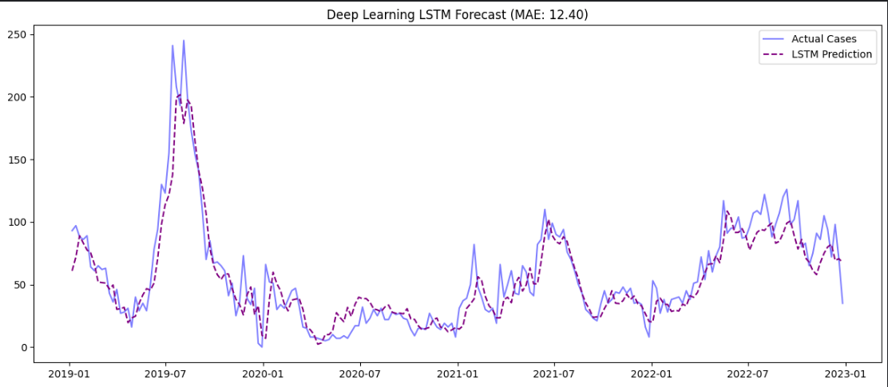

# 🦟 Dengue-Defensor: Climate-Driven Disease Early Warning System

### **Project Overview**
Dengue fever affects thousands of Filipinos annually, costing the government millions in reactive healthcare. **Dengue-Defensor** is a Machine Learning initiative designed to shift the response from *reactive* to *proactive*.

By analyzing 15 years of climate and disease surveillance data from **Project C-CHAIN**, this project compares **Classical ML (XGBoost/LightGBM)** against **Deep Learning (LSTM)** to find the most accurate forecasting method for **Davao City**.

The model predicts Dengue cases **1-8 weeks in advance**, giving Local Government Units (LGUs) critical lead time to mobilize resources before an outbreak peaks.

---

### 🏆 Model Leaderboard (Benchmark Results)

After rigorous experimentation, **Deep Learning** outperformed classical methods, demonstrating the importance of capturing sequential temporal patterns in disease forecasting.

| Rank | Model | MAE (Mean Abs Error) | Interpretation |
| :--- | :--- | :--- | :--- |
| 🥇 | **LSTM (Deep Learning)** | **12.40** | **Best Forecast.** Captured complex non-linear dependencies in the time series. |
| 🥈 | **XGBoost** | *13.20* | Very close second. Excellent baseline and highly interpretable. |
| 🥉 | **LightGBM** | *14.02* | Good speed, but struggled slightly with the smaller dataset size compared to XGBoost. |

*> **Note:** MAE represents the average number of cases the model is "off" by per week. Given that outbreaks can reach hundreds of cases, an error of ~12 is highly actionable.*

#### 📉 Forecast Visualization (LSTM)
*> The graph below demonstrates the model's ability to track outbreak spikes (Red Dashed Line) against actual reported cases (Blue Line).*



---

### 🔍 Scientific Analysis: What Drives an Outbreak?
Our analysis identified a **Hybrid Driver** mechanism for Dengue outbreaks in Davao City. The model learned to balance two distinct signals:

#### 1. The Epidemiological Signal (Momentum)
* **Top Features:** `cases_lag1w` (Rank #1) and `cases_lag2w` (Rank #2).
* **Role:** **Momentum Detection.** The model uses the difference between last week (Lag 1) and two weeks ago (Lag 2) to calculate the "acceleration" of the outbreak. This allows it to distinguish between a growing spike and a dying wave, even if the raw case numbers are similar.

#### 2. The Environmental Signal (The Catalyst)
* **Top Feature:** `rain_roll_sum_8w`.
* **Role:** **The Trigger.** While past cases set the baseline, **heavy rainfall accumulation over the previous 2 months** is the key signal that pushes the prediction *above* the baseline. This mathematically confirms the biological delay of mosquito breeding cycles (4-8 weeks).

---

### 🧠 Model Architectures

#### **1. LSTM (The Selected Model)**
* **Type:** Recurrent Neural Network (RNN).
* **Architecture:** 50-unit LSTM Layer with 20% Dropout + Dense Output.
* **Why it won:** Unlike trees, LSTM maintains an internal "memory state," allowing it to understand that *trends* (sequences) matter as much as the raw numbers.

#### **2. XGBoost (The Baseline)**
* **Type:** Gradient Boosting Decision Tree (Level-wise growth).
* **Architecture:** Ensemble of trees trained to correct the errors of previous trees.
* **Key Logic:** Optimized for "Level-wise" tree growth, making it robust against overfitting on medium-sized datasets like this one.

#### **3. LightGBM**
* **Type:** Gradient Boosting Decision Tree (Leaf-wise growth).
* **Key Logic:** Uses "Leaf-wise" growth (Best-first) and histogram-based algorithms for speed.
* **Performance Note:** While it was the fastest to train, LightGBM tends to overfit on smaller datasets (<10k rows) compared to XGBoost, which explains its slightly higher error rate in this specific pilot.

---

### 🛠️ Tech Stack
* **Language:** Python 3.10
* **Data Processing:** Pandas, NumPy
* **Machine Learning:** XGBoost, LightGBM, Scikit-Learn
* **Deep Learning:** TensorFlow, Keras
* **Visualization:** Matplotlib, Seaborn
* **Version Control:** Git

---

### 📂 Repository Structure
```text
dengue-forecasting-ph/
│
├── notebooks/
│   ├── 01_exploratory_data_analysis.ipynb   # ETL Pipeline
│   ├── 02_feature_engineering.ipynb         # Lags & Seasonality
│   ├── 03_forecasting_xgboost.ipynb         # Classical ML Baseline
│   ├── 04_experiment_lightgbm.ipynb         # Efficiency Test
│   └── 05_experiment_lstm.ipynb             # Deep Learning (Selected)
│
├── data/
│   └── processed/                           # Cleaned CSVs (GitIgnored)
│   └── raw/                                 # Raw data
│
├── models/
│   └── dengue_lstm_v1.pkl                   # Trained Model File
│   
└── README.md
```
### 👨‍💻 Author
**Edsequille Publico** 
*Aspiring AI/Machine Learning Engineer | Focused on AI for Social Good*