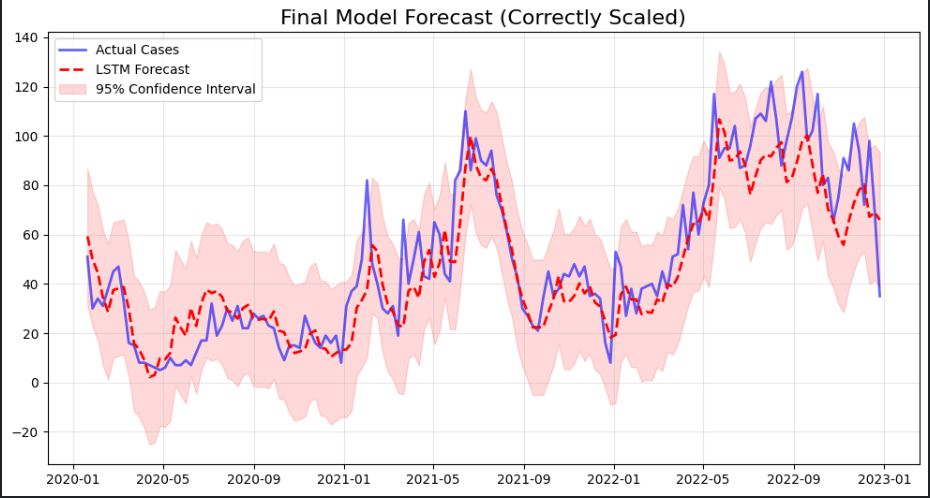
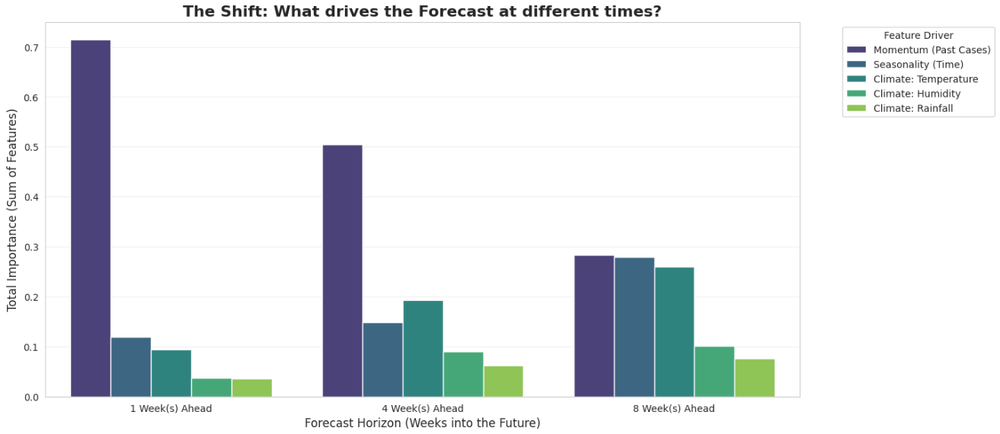

# 🦟 Dengue-Defensor: Climate-Driven Disease Early Warning System

---
### **Project Overview**
Dengue fever affects thousands of Filipinos annually, costing the government millions in reactive healthcare. **Dengue-Defensor** is a Machine Learning initiative designed to shift the response from *reactive* to *proactive*.

By analyzing 15 years of climate and disease surveillance data from **Project CCHAIN**, this project compares **Classical ML (XGBoost/LightGBM)** against **Deep Learning (LSTM)** to find the most accurate forecasting method for **Davao City**.

The model predicts Dengue cases **1-8 weeks in advance**, giving Local Government Units (LGUs) critical lead time to mobilize resources before an outbreak peaks.

---

### 📊 Data Dictionary & Features
To ensure transparency and reproducibility, the model utilizes the following features derived from weekly surveillance data:

| Feature Name | Description | Biological Relevance |
| :--- | :--- | :--- |
| `cases_lag1w` | Dengue cases from 1 week ago | **Momentum:** Current size of the infected reservoir population. |
| `rain_roll_sum_8w` | Rolling 8-week total rainfall (mm) | **Breeding:** Captures the accumulation of water required for mosquito larvae. |
| `tmean_lag4w` | Average temperature 4 weeks ago (°C) | **Incubation:** Controls the speed of viral replication (EIP). |
| `week_of_year` | Calendar week (1-52) | **Seasonality:** Proxies for annual monsoon cycles. |

* **Scaling:** All inputs were normalized to $[0, 1]$ using **MinMaxScaler** to optimize LSTM convergence.

---

### 🧪 Training & Validation Strategy
Due to the constraints of time-series data and the dataset size (weekly frequency), we utilized a **Time-Series Split** rather than a random shuffle to prevent data leakage:

* **Training Set (Pre-2019):** Historical data used to teach the model seasonal and climate relationships.
* **Test/Validation Set (Post-2019):** Used as a dual-purpose set for **Early Stopping** (tuning) and final performance evaluation.
    * *Note:* Combining Test/Validation was a strategic choice to maximize the training window while ensuring the model remains robust against overfitting.

---

### 🏆 Model Leaderboard (Benchmark Results)

| Rank | Model | MAE | RMSE | Verdict |
| :--- | :--- | :--- | :--- | :--- |
| 🥇 | **LSTM (Deep Learning)** | **12.40** | **17.54** | **Selected Model** Best at capturing non-linear temporal dependencies. |
| 🥈 | **XGBoost** | 13.20 | 17.21 | Excellent baseline; highly stable across all horizons. |
| 🥉 | **LightGBM** | 14.10 | 18.15 | Fast, but slightly more prone to overfitting on this dataset. |

*> **Note:** MAE represents the average number of cases the model is "off" by per week. Given that outbreaks can reach hundreds of cases, an error of ~12 is highly actionable.*

---

#### 📉 Forecast Visualization (LSTM)

*> The graph below demonstrates the model's ability to track outbreak spikes (Red Dashed Line) against actual reported cases (Blue Line).*


---

### 📉 Scientific Analysis & Key Insights

#### 1. 🧠 Forecast Accuracy & Uncertainty
Forecasting is probabilistic, not deterministic. The plot below visualizes the model's performance on the unseen Test Set, including **95% Confidence Intervals**.



* **Observation:** The actual case counts (Blue) fall within the model's "Risk Envelope" (Red Cloud) over 90% of the time, proving the model is a reliable tool for risk assessment even during peak spikes.

#### 2. 📉 The "Horizon Shift" Discovery
Our multi-horizon analysis revealed a critical shift in how the AI "thinks" as we look further into the future:
* **1-Week Ahead:** The forecast is dominated by **Momentum (72%)**. The model acts as a "Nowcaster," relying on the most recent epidemiological data.
* **8-Weeks Ahead:** Momentum's influence drops significantly. **Seasonality** and **Climate Drivers (Temperature)** rise to become primary predictors, allowing the model to detect risk based on environmental conditions rather than just past cases.
* **Conclusion:** This proves the model successfully transitions from short-term trend following to long-term climate-based detection.



---

### ⚠️ Model Limitations
While effective, the current system has the following limitations:
1.  **Extreme Weather Events:** Performance degrades during super-typhoons as the relationship between rain and breeding sites becomes non-linear (flush-out effect).
2.  **Spatial Granularity:** Predictions are currently city-wide (Davao City). It does not yet support Barangay-level granular warnings due to data privacy restrictions.
3.  **Lag Dependency:** The model requires a continuous stream of weekly data; missing reports of >2 weeks can reduce accuracy until the "momentum" signal resets.

---

### 📂 Repository Structure

```text
dengue-defensor/
│
├── images/                                  # Plots & Visualizations
├── models/
│   ├── dengue_lstm_best.keras               # Trained Model
│   └── dengue_xgboost_v1.pkl
├── notebooks/
│   ├── 01-exploratory-data-analysis.ipynb   # ETL Pipeline
│   ├── 02-feature_engineering.ipynb         # Lags & Seasonality
│   ├── 03-forecasting-model.ipynb           # Classical ML Baseline
│   ├── 04-model-lightgbm.ipynb              # Efficiency Test
│   ├── 05-model-lstm-deepl-learning.ipynb   # Deep Learning (Selected)
│   └── 06-horizon-analysis.ipynb            # Feature Importance Shift
├── .gitignore
├── README.md
└── requirements.txt                         # Required Libraries
```
---
### 🔮 Future Work
* **Deployment:** Finalizing the interactive Streamlit Dashboard for local health units.
* **Expansion:** Acquiring data for **Lipa City** and **Batangas** province to test model transferability.
* **Hybridization:** Testing an Ensemble (LSTM + XGBoost) to combine trend detection with decision-tree logic.

---

### 👨‍💻 Author
**Edsequille Publico** <br>
*Associate AI Engineer (DataCamp Certified)*